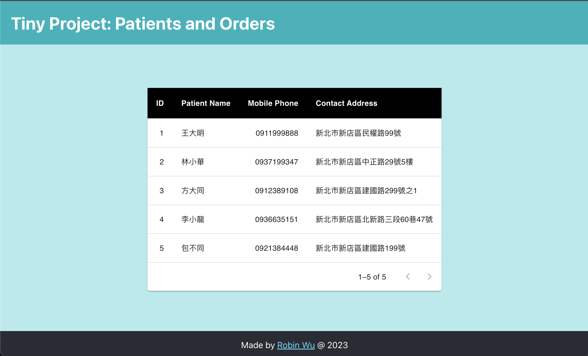

# Jubo Tiny Project

## Getting Started

- Please use node v16 (I'm using v16.20.2) to run this application.
- Run the development server:

```bash
# build the app and start FE service.
yarn && yarn start
```

- Open http://localhost:3000 with your browser to see the result.

## Snapshot


